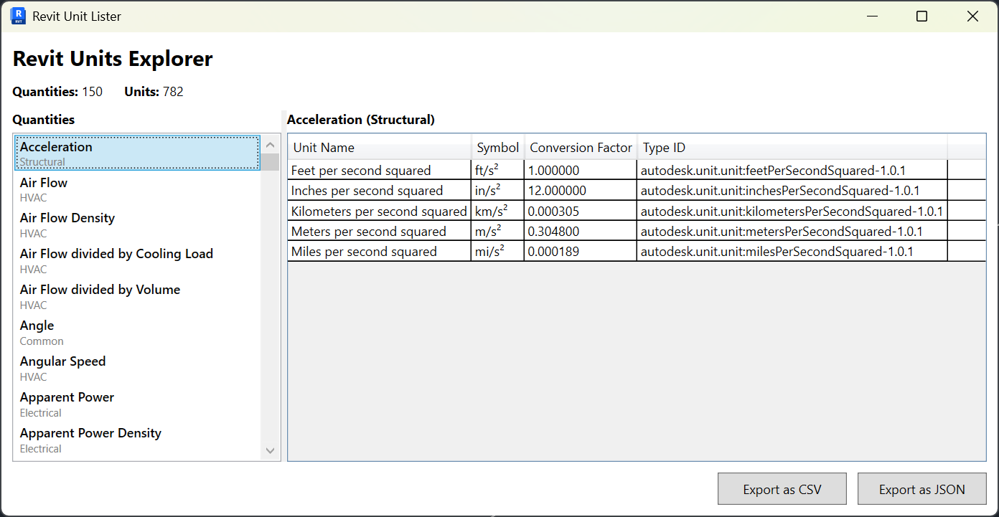
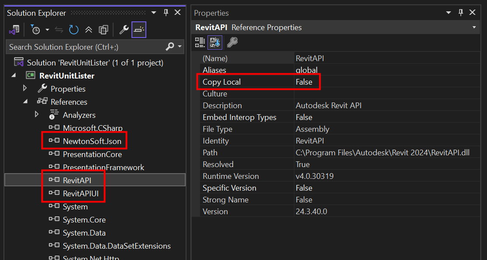
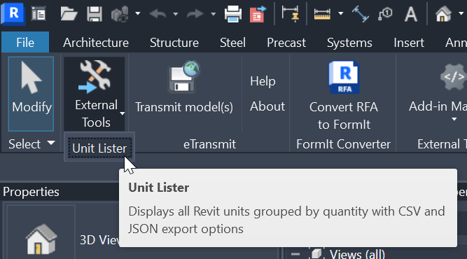

# Revit Unit Lister

[](https://dotnet.microsoft.com/download/dotnet-framework/net48)
[](https://www.autodesk.com/products/revit/)

A Revit 2024 plugin that lists and exports all supported units with their ForgeTypeIds, symbols, and conversion factors.

**Source code only - no binaries provided.**

## Features

- **Simple WPF User Interface** - Browse units in an intuitive interface
- **Grouped by Quantity** - All units organized by their spec type/quantity and discipline
- **Detailed Unit Information** including:
  - Display Name
  - Unit Symbol
  - Type ID
  - Conversion Factor from Revit internal units
- **Export Options**:
  - **JSON Export** - Structured data with hierarchy
  - **CSV Export** - Flat format for Excel/spreadsheet analysis
- **Live Statistics** - See total quantities and units at a glance
- **Error & Warning Tracking** - View and export any issues encountered during data collection



## Setup

After cloning, you might have to fix assembly references in the project:
- `RevitAPI.dll` → `C:\Program Files\Autodesk\Revit 2024\`
- `RevitAPIUI.dll` → `C:\Program Files\Autodesk\Revit 2024\`
- `Newtonsoft.Json.dll` → `C:\Program Files\Autodesk\Revit 2024\`

**Set Copy Local = False for all three references!**



## Installation

Build the project. The following files are copied into your Revit 2024 addins folder:
- `RevitUnitLister.dll`
- `RevitUnitLister.addin`

Post build event:
```batch
xcopy /Y /I "$(TargetPath)" "%AppData%\Autodesk\Revit\Addins\2024\"
xcopy /Y /I "$(ProjectDir)$(TargetName).addin" "%AppData%\Autodesk\Revit\Addins\2024\"
```

## Usage

1. Open Revit 2024
2. Go to the **Add-Ins** tab
3. Click **External Tools** dropdown
4. Select **Unit Lister**



5. A WPF window opens displaying all units grouped by quantity
6. Select quantities in the left panel to view their units
7. **If errors or warnings exist**, an "Issues" expander will appear:
   - Click "Errors" or "Warnings" to filter issues
   - Click "Copy to Clipboard" to export issues for debugging
8. Click **Export as CSV** or **Export as JSON** to save the data


## Notes

- The conversion factor represents the multiplier to convert from Revit's internal units to the target unit
- For example, Revit internally uses feet for length, so converting 1.0 feet to meters gives ~0.3048
- The application is read-only and does not modify your Revit project
- **All errors and warnings are tracked**

## License

**Unlicense / Public Domain**
```plaintext
This is free and unencumbered software released into the public domain.

Anyone is free to copy, modify, publish, use, compile, sell, or
distribute this software, either in source code form or as a compiled
binary, for any purpose, commercial or non-commercial, and by any
means.

In jurisdictions that recognize copyright laws, the author or authors
of this software dedicate any and all copyright interest in the
software to the public domain. We make this dedication for the benefit
of the public at large and to the detriment of our heirs and
successors. We intend this dedication to be an overt act of
relinquishment in perpetuity of all present and future rights to this
software under copyright law.

THE SOFTWARE IS PROVIDED "AS IS", WITHOUT WARRANTY OF ANY KIND,
EXPRESS OR IMPLIED, INCLUDING BUT NOT LIMITED TO THE WARRANTIES OF
MERCHANTABILITY, FITNESS FOR A PARTICULAR PURPOSE AND NONINFRINGEMENT.
IN NO EVENT SHALL THE AUTHORS BE LIABLE FOR ANY CLAIM, DAMAGES OR
OTHER LIABILITY, WHETHER IN AN ACTION OF CONTRACT, TORT OR OTHERWISE,
ARISING FROM, OUT OF OR IN CONNECTION WITH THE SOFTWARE OR THE USE OR
OTHER DEALINGS IN THE SOFTWARE.

For more information, please refer to <https://unlicense.org/>
```